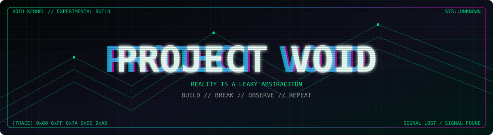

<div align="center">




</div>

```text
[00:00:00.001] INIT       reality.sys
[00:00:00.008] LOAD       questionable_ideas.so
[00:00:00.013] MOUNT      /dev/curiosity
[00:00:00.021] WARN       sanity_check() returned NULL
[00:00:00.034] EXEC       ./something_that_should_not_work

FATAL: universe exceeded expected complexity.

RECOVERY ATTEMPT ....................... FAILED
RETRYING ............................... INFINITE
```

<div align="center">


<br/>


<br/>


<sub>0x00 — NOTHING IS AS SIMPLE AS IT LOOKS.</sub>

</div>
